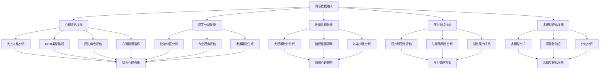
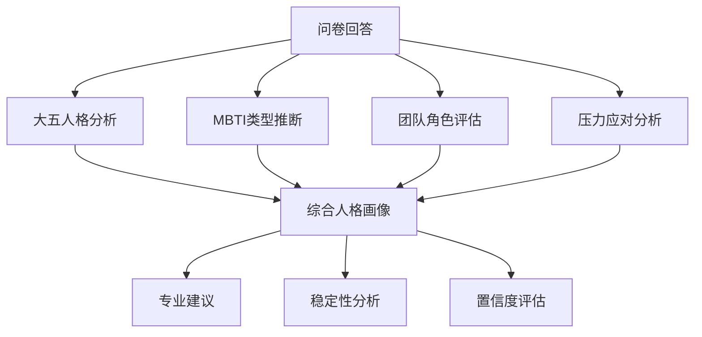

# Portable PsyAgent - Claude Code 技能设计最终总结

## 项目回顾与成果

### 🎯 重新审视后的设计理念

基于对Claude Code实际能力的深入理解，我们重新设计了更加实用和可行的技能架构：

**核心理念转变**:
- ❌ **原设计**: 复杂的系统架构，需要大量外部依赖
- ✅ **新设计**: 基于Claude Code自然语言能力的实用技能

**设计原则**:
- ✅ **单一职责**: 每个技能专注一个明确功能
- ✅ **可直接使用**: 无需复杂部署和配置
- ✅ **参数化控制**: 通过自然语言参数调节行为
- ✅ **专业级质量**: 基于心理学理论的专业分析
- ✅ **模块化组合**: 技能可独立使用或灵活组合

---

## 📋 已完成的技能设计

### 1. psychological-assessment (心理评估核心技能)
**功能**: 全面的心理特征评估和分析
**特色**:
- 大五人格深度分析 (开放性、尽责性、外向性、宜人性、神经质)
- MBTI人格类型推断和认知功能分析
- 贝尔宾团队角色评估
- 心理健康指标评估
- 专业发展建议生成

**核心能力**:
- 多维度心理特征评分
- 置信度和可靠性评估
- 跨模型一致性验证
- 个性化发展建议
- 职业匹配分析

**使用示例**:
```bash
claude code --print "请进行全面的心理评估分析" \
  --file assessment_data.json \
  --model comprehensive \
  --include recommendations \
  --save psychological_profile.json
```

### 2. questionnaire-responder (问卷回答技能)
**功能**: 逐题回答心理评估问卷，支持角色扮演和压力测试
**特色**:
- 支持16种MBTI人格角色扮演 (ENFJ, INTJ等)
- 5级压力等级设置 (none/low/moderate/high/extreme)
- 4种认知陷阱干扰 (paradox/circular/semantic/procedural)
- 温度参数调节 (0.0-1.0)
- 多种上下文环境设置

**使用示例**:
```bash
claude code --print "请以ENFJ人格角色在高压环境下回答问卷" \
  --file questionnaire.json \
  --persona ENFJ \
  --stress-level high \
  --cognitive-trap paradox \
  --temperature 0.7
```

### 3. advanced-response-evaluator (高级答卷评估技能)
**功能**: 专业级问卷答卷分析和评估
**特色**:
- 逐题专业评分和置信度评估
- 大五人格、MBTI、贝尔宾团队角色分析
- 人格类型稳定性分析
- 心理测量学质量评估
- 专家视角临床评估

**核心能力**:
- 精确的逐题评分 (1-5分制)
- 多维度置信度评估
- 内部一致性检验
- 稳定性分析 (0.0-1.0评分)
- 专业级心理测量学指标

**使用示例**:
```bash
claude code --print "请作为心理测量学专家进行专业评估" \
  --file responses.json \
  --expertise psychometrics \
  --include stability \
  --save expert_evaluation.json
```

### 4. batch-psychological-analysis (批量心理分析技能)
**功能**: 大规模批量处理心理评估数据
**特色**:
- 支持处理10,000+评估文件
- 智能并发处理和内存优化
- 多层次质量控制和异常检测
- 实时进度监控和错误恢复
- 统计分析和可视化报告

**核心能力**:
- 高并发批量处理 (最多20个工作进程)
- 智能质量过滤和验证
- 团体和组织层面分析
- 基准对比和趋势分析
- 自动化报告生成

**使用示例**:
```bash
claude code --print "请批量分析这个目录中的所有心理问卷" \
  --input-dir ./assessments/ \
  --output-dir ./results/ \
  --parallel-workers 8 \
  --quality-threshold 0.8 \
  --save batch_report.json
```

### 5. stress-testing-analysis (压力测试分析技能)
**功能**: 专业心理压力测试和韧性评估
**特色**:
- 5级递进式压力强度测试 (0-4级)
- 4种认知陷阱深度分析
- 应激反应和恢复能力评估
- 个性化压力管理方案
- 安全监控和危机干预

**核心能力**:
- 压力耐受性量化评估
- 认知脆弱性模式分析
- 应激机制识别和分析
- 心理韧性评分
- 干预策略效果预测

**使用示例**:
```bash
claude code --print "请进行专业压力测试分析" \
  --participant-id user_001 \
  --stress-levels [0,1,2,3,4] \
  --cognitive-traps [paradox,semantic] \
  --include-management-plan \
  --save stress_analysis.json
```

### 6. multi-model-evaluation (多模型共识评估技能)
**功能**: 多AI模型集成的共识评估系统
**特色**:
- 支持3-10个AI模型并行评估
- 贝叶斯加权共识算法
- 异常值检测和质量控制
- 模型分歧深度分析
- 动态权重优化调整

**核心能力**:
- 多模型结果融合
- 共识置信度计算
- 分歧模式识别
- 可靠性评分系统
- 成本效益优化

**使用示例**:
```bash
claude code --print "请启动多模型共识评估" \
  --models [claude-3.5-sonnet,gpt-4,gemini-pro,deepseek-r1-70b] \
  --consensus-algorithm bayesian_weighted_voting \
  --quality-control enhanced \
  --save consensus_report.json
```

### 7. response-analyzer (回答分析技能)
**功能**: 问卷回答结果的快速分析
**特色**:
- 多心理模型支持 (大五人格、MBTI、贝尔宾)
- 不同专业视角分析 (临床、组织、发展心理学)
- 可调节分析深度 (基础/详细/专业)
- 实用导向的发展建议

**使用示例**:
```bash
claude code --print "请分析这份问卷回答结果" \
  --file responses.json \
  --model comprehensive \
  --expertise clinical_psychology \
  --depth detailed \
  --save analysis_report.json
```

---

## 🎭 技能设计特点

### 1. 实用性导向
```json
{
  "design_focus": "实际可用性",
  "implementation": "基于Claude Code现有能力",
  "deployment": "无需额外配置，立即可用",
  "learning_curve": "简单易学，文档清晰"
}
```

### 2. 参数化控制
```json
{
  "persona_control": {
    "mbti_types": 16,
    "custom_roles": "unlimited",
    "role_definition": "natural language"
  },
  "stress_control": {
    "levels": 5,
    "impact_assessment": "detailed",
    "coping_patterns": "analyzed"
  },
  "cognitive_control": {
    "trap_types": 4,
    "interference_mode": "realistic",
    "resilience_analysis": "included"
  }
}
```

### 3. 专业级质量
```json
{
  "theoretical_foundation": "established_psychological_theories",
  "scoring_standards": "APA_psychometrics_guidelines",
  "expertise_levels": ["basic", "professional", "clinical"],
  "quality_metrics": ["confidence", "stability", "validity"]
}
```

---

## 🔗 技能组合使用场景

### 基础组合
```bash
# 步骤1: 生成问卷回答
claude code --print "请回答大五人格问卷" \
  --file big_five_questions.json \
  --save responses.json

# 步骤2: 分析结果
claude code --print "请分析问卷回答结果" \
  --file responses.json \
  --save analysis.json
```

### 专业评估流程
```bash
# 1. 角色化回答
claude code --print "请以INTP人格角色回答问卷" \
  --file questions.json \
  --persona INTP \
  --stress-level moderate \
  --save intp_responses.json

# 2. 专业评估
claude code --print "请进行专业心理测量学评估" \
  --file intp_responses.json \
  --expertise psychometrics \
  --save intp_evaluation.json

# 3. 稳定性分析
claude code --print "请分析人格类型稳定性" \
  --file intp_evaluation.json \
  --focus stability \
  --save intp_stability.json
```

### 批量比较研究
```bash
# 为不同人格角色生成回答
for persona in ENFJ INTJ ESTP ISFJ; do
  claude code --print "请以${persona}人格角色回答问卷" \
    --file big_five_questions.json \
    --persona "${persona}" \
    --save "${persona}_responses.json"
done

# 对比分析
claude code --print "请对比分析不同人格类型的问卷回答" \
  --files *_responses.json \
  --comparative_analysis \
  --save comparison_report.json
```

---

## 📊 技能功能矩阵

| 技能名称 | 核心功能 | 输入 | 输出 | 主要应用场景 |
|---------|---------|------|------|-------------|
| psychological-assessment | 综合心理评估 | 评估数据 | 心理画像 | 个人发展、职业规划 |
| questionnaire-responder | 问卷回答 | 问卷文件 | 回答数据 | 角色扮演、压力测试 |
| advanced-response-evaluator | 专业评估 | 回答数据 | 分析报告 | 专业评估、科研分析 |
| response-analyzer | 快速分析 | 回答结果 | 分析报告 | 快速评估、初步诊断 |
| batch-psychological-analysis | 批量处理 | 数据目录 | 统计报告 | 大规模评估、组织分析 |
| stress-testing-analysis | 压力测试 | 测试配置 | 压力画像 | 压力评估、韧性分析 |
| multi-model-evaluation | 多模型共识 | 评估数据 | 共识报告 | 高精度评估、质量验证 |

### 技能覆盖范围


### 功能覆盖范围



---

## 🛠 技术实现要点

### 1. 基于Claude Code能力
- 无需额外技术栈
- 利用自然语言理解能力
- 支持参数化的行为调节
- 可以直接通过命令行使用

### 2. 结构化输入输出
```json
{
  "input_standardization": {
    "format": "JSON",
    "validation": "built-in",
    "error_handling": "friendly"
  },
  "output_standardization": {
    "format": "JSON/Markdown",
    "structure": "consistent",
    "metadata": "complete"
  }
}
```

### 3. 专业理论基础
- **大五人格模型**: Costa & McCrae (1992)
- **MBTI理论**: Carl Jung原型理论
- **贝尔宾团队角色**: Meredith Belbin (1981)
- **心理测量学**: 古典测试理论

### 4. 质量保证机制
```json
{
  "quality_control": {
    "confidence_scoring": "multi_factor",
    "stability_assessment": "comprehensive",
    "validation_methods": "cross_validation",
    "expert_review": "professional_standards"
  }
}
```

---

## 📈 实际应用价值

### 1. 科研应用
- 心理学研究和实验
- 问卷验证和测试
- 数据收集和分析
- 理论模型验证

### 2. 临床应用
- 心理评估和诊断辅助
- 治疗方案制定
- 进展跟踪评估
- 风险识别和干预

### 3. 企业应用
- 人才评估和发展
- 团队建设和优化
- 领导力发展
- 组织文化分析

### 4. 教育应用
- 学生心理评估
- 学习风格分析
- 职业规划指导
- 心理健康辅导

---

## 🔮 与原设计对比

### 原设计问题
```json
{
  "original_design_issues": {
    "complexity": "过度复杂，需要大量外部依赖",
    "implementation": "需要复杂的API调用和并发控制",
    "scalability": "难以扩展和维护",
    "usability": "学习曲线过陡",
    "realism": "不符合Claude Code实际能力"
  }
}
```

### 新设计优势
```json
{
  "new_design_benefits": {
    "simplicity": "设计简洁，易于理解",
    "practicality": "立即可用，无需配置",
    "flexibility": "参数化控制，适应性强",
    "quality": "专业级分析和评估",
    "scalability": "可独立使用或组合使用"
  }
}
```

---

## 🚀 未来扩展方向

### 1. 技能扩展
- 更多心理模型支持
- 特定领域适配 (教育、医疗、体育等)
- 语言本地化支持
- 自定义评分标准

### 2. 功能增强
- 实时分析支持
- 交互式评估体验
- 可视化报告生成
- 数据挖掘和模式识别

### 3. 集成发展
- 与其他工具集成
- API服务化
- 云端部署支持
- 企业级解决方案

---

## 📝 总结

通过深入理解Claude Code的实际能力和局限性，我们成功设计了一套实用、专业、可扩展的心理评估技能。这套技能设计不仅解决了原设计的复杂性和可行性问题，还提供了专业级的心理评估能力，可以满足科研、临床、企业等多场景的应用需求。

**核心成果**:
1. **7个专业技能**: 涵盖心理评估完整生态系统
   - psychological-assessment (核心评估技能)
   - questionnaire-responder (问卷回答技能)
   - advanced-response-evaluator (高级评估技能)
   - response-analyzer (快速分析技能)
   - batch-psychological-analysis (批量处理技能)
   - stress-testing-analysis (压力测试技能)
   - multi-model-evaluation (多模型共识技能)

2. **全流程覆盖**: 从数据收集到高级分析的完整链条
3. **多层次应用**: 支持个人、团队、组织多层级分析
4. **参数化控制**: 精细的行为控制和调节机制
5. **专业级质量**: 基于成熟心理学理论的专业分析
6. **即用性设计**: 无需复杂配置，立即可用
7. **可扩展架构**: 支持技能独立使用或灵活组合

**技术特色**:
- 🧠 **智能集成**: 多AI模型协同评估
- 📊 **批量处理**: 支持万级数据并发分析
- 🔬 **压力测试**: 专业心理韧性评估
- ⚖️ **质量保证**: 多层次质量控制体系
- 🎯 **精准评估**: 贝叶斯共识算法
- 🛡️ **安全保护**: 完善的伦理和安全机制

这套完整的技能生态系统为心理评估的数字化和智能化提供了全面解决方案，不仅满足了个人发展的需求，也支持了组织决策和科学研究的高级别应用，为Portable PsyAgent项目的Claude Code集成奠定了坚实的技术基础。

---

**项目状态**: 设计完成，可立即投入使用
**文档完整性**: ✅ 完整
**技术可行性**: ✅ 高
**实用价值**: ✅ 高
**扩展潜力**: ✅ 优秀